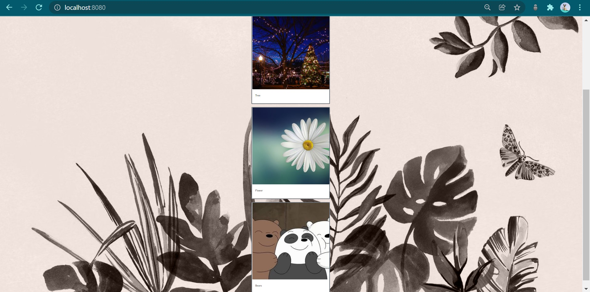

# Social-Networking-Dapp
## **ABOUT**
- Social networking Blockchain app built using Ethereuem Blockchain, Remix , Metamask ,IPFS and Vue.js
- The blockchain based social media app proposed here allows you to share content in a decentralized environment giving you a meaningful control over privacy and value for content being shared.
## **ARCHITECTURE**
- **Interplanetary File System (IPFS)** that is a protocol and peer-to-peer network for
storing and sharing data using content addressing to uniquely identify each file in a global
namespace connecting all the computing devices.
- **Ethereum** Blockchain that helps to run the smart contract in the backend and even for
data storage and it also provides Ether to run the contract and post images.
- **Metamask** is a software cryptocurrency wallet used to interact with the Ethereum
blockchain. It allows users to access their Ethereum wallet through a browser extension
or mobile app, which can then be used to interact with decentralized applications.
- **Remix IDE** is an open-source web and desktop application that fosters a fast
development cycle and rich plugins for deploying smart contracts.
- **Vue.js** which is progressive JavaScript framework that helps to build the frontend web
interfaces and one page application.
- **Web3.js** is used to interact with local or remote Ethereum nodes using HTTP, IPC or
WebSocket.
## **SETUP**
- Clone the Repository
- Run "npm install" 
- Deploy your smart contract (Posts.sol) on Remix
- Update ContractInstance.js with the ABI and address obtained by deploying on Remix
- Run "npm run dev"
- Connect your app with metamask
- Now you can upload the images and description and view your posts!
## **SCREENSHOTS**
# Landing Page

# Remix contract

# Metamask connect

# Wall

 

